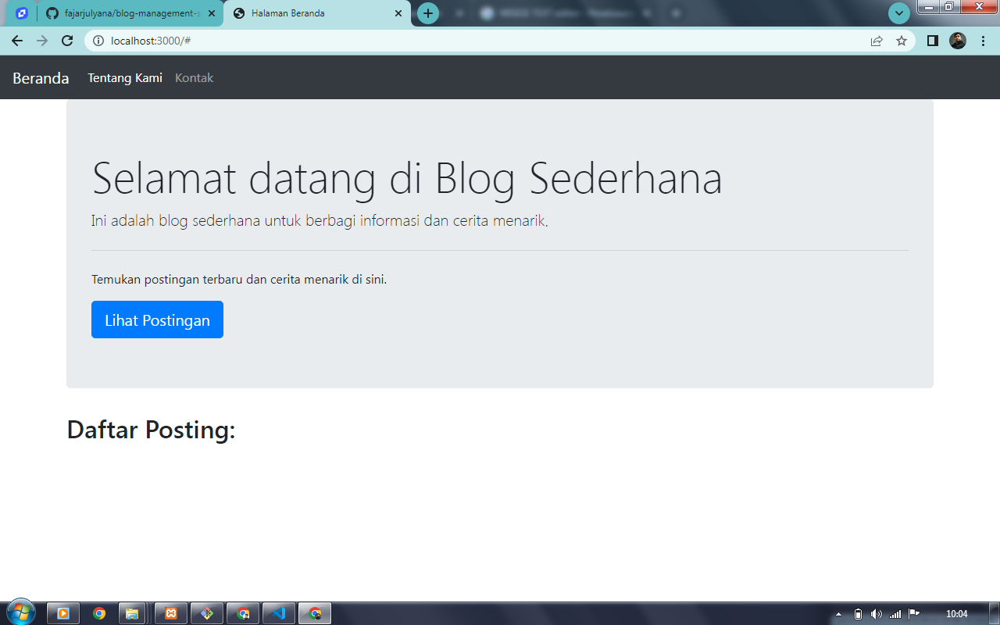

# Blog Management System

This is a simple Blog Management System built with Node.js, Express, EJS, and MySQL. It allows you to create, read, update, and delete blog posts.

## Table of Contents

- [Features](#features)
- [Requirements](#requirements)
- [Getting Started](#getting-started)
- [Configuration](#configuration)
- [Usage](#usage)
- [License](#license)

## Features

- Create new blog posts with a title and content.
- View a list of all blog posts.
- Edit existing blog posts.
- Delete unwanted blog posts.

## Requirements

- Node.js
- Express.js
- EJS (Embedded JavaScript) for templating
- MySQL or any other compatible database

## Getting Started

1. Clone the repository:

   ```bash
   git clone https://github.com/fajarjulyana/blog-management-system-ui.git
   cd blog-management-system-ui
   ```

2. Install the project dependencies:

   ```bash
   npm install
   ```

3. Configure your MySQL database settings in `app.js` and create the necessary database tables.

4. Start the application:

   ```bash
   node index.js
   ```

5. Access the application in your web browser at `http://localhost:3000`.

## Configuration

You will need to configure your database connection by updating the following lines in `app.js`:

```javascript
const db = mysql.createConnection({
  host: 'localhost',
  user: 'root',
  password: '',
  database: 'blogsdb'
});
```

## Usage

- Access the dashboard by visiting `http://localhost:3000/login`.
- Log in as an administrator to manage blog posts.
- Create, edit, or delete blog posts from the dashboard.

## License

This project is licensed under the MIT License. See the [LICENSE](LICENSE) file for details.
